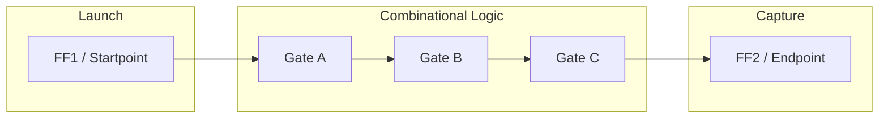
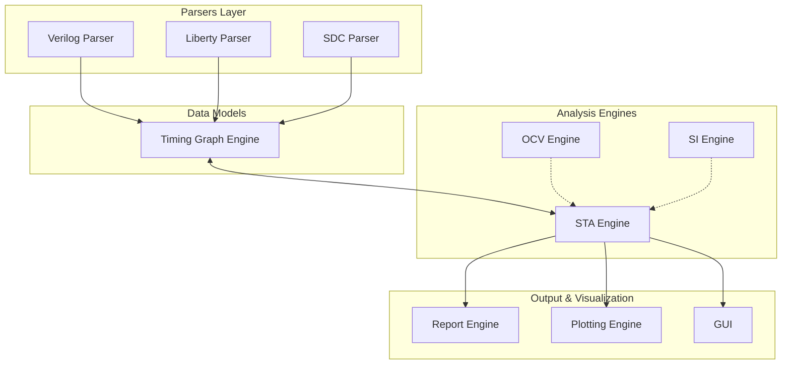
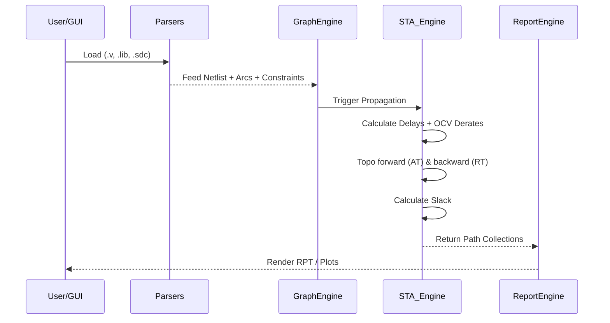

# PySTA: Static Timing Analysis & Timing Verification Framework

## 1. Executive Summary

**PySTA** is a highly modular, Python-based Static Timing Analysis (STA) and timing verification framework. It replicates the core functionality and engine architecture of industry-standard Electronic Design Automation (EDA) tools like Synopsys PrimeTime or Cadence Tempus, tailored for research, educational, and lightweight analysis purposes. 

In VLSI design, ensuring that a digital circuit functions correctly at a specified clock frequency is paramount. STA is the mathematically rigorous process of verifying this timing without requiring exhaustive simulation. PySTA solves the problem of accessibility and extensibility in EDA by providing an open, readable, and architecturally sound Python framework capable of parsing industry-standard formats (Verilog, Liberty, SDC), constructing directed acyclic graphs (DAGs) representing timing paths, computing propagation delays, accounting for On-Chip Variation (OCV) and Signal Integrity (SI), and generating comprehensive timing reports.

---

## 2. What is Static Timing Analysis (STA)?

Static Timing Analysis evaluates the expected timing of a digital circuit without requiring dynamic input vectors. By breaking down the design into timing paths, STA guarantees that data arrives at memory elements within specific operating windows.

### Key Concepts

*   **Arrival Time (AT)**: The time it takes for a signal to traverse from a timing startpoint to a specific node in the design.
*   **Required Time (RT)**: The specific time by which a signal *must* arrive at a node to prevent a timing violation.
*   **Slack**: The margin between the Required Time and the Arrival Time. Positive slack indicates timing is met; negative slack indicates a violation.
*   **Setup Timing**: Ensures data arrives at a flip-flop early enough before the active clock edge so it can be reliably captured. (Max delay check).
*   **Hold Timing**: Ensures data remains stable long enough after the clock edge to prevent the flip-flop from inadvertently capturing the "next" data value preemptively. (Min delay check).
*   **Critical Path**: The timing path with the worst (most negative or smallest positive) slack.
*   **Clock Domains**: Groups of sequential elements driven by specific clock trees. Interactions between synchronous and asynchronous domains dictate path constraints.

---

## 3. High-Level System Architecture

PySTA uses a distinct separation of concerns, isolating parsing, graph construction, timing analysis, and presentation layers. 

---

## 4. Complete Folder Structure Analysis

The architecture maps to directories under [Src/](Src/).

### [Src/verilog_parser](Src/verilog_parser)
Responsible for parsing the structural Verilog netlist, mapping instances to standard cells, and extracting wire connectivity to form the foundational netlist state.
*   [Src/verilog_parser/verilog_parser.py](Src/verilog_parser/verilog_parser.py): Entry point for parsing syntactic Verilog blocks.
*   [Src/verilog_parser/netlist_builder.py](Src/verilog_parser/netlist_builder.py): Converts syntax tokens into discrete logical instances and nets.
*   [Src/verilog_parser/module_resolver.py](Src/verilog_parser/module_resolver.py): Resolves hierarchical designs into a flattened timing view.

### [Src/liberty_parser](Src/liberty_parser)
Handles parsing `.lib` files to formulate timing arcs, cell delays, and transition times.
*   [Src/liberty_parser/liberty_parser.py](Src/liberty_parser/liberty_parser.py): Syntactic `.lib` parser handling complex nested C-like structures.
*   [Src/liberty_parser/timing_arc_extractor.py](Src/liberty_parser/timing_arc_extractor.py): Extracts unit delay rules, Unate-ness properties, and transition tables.
*   [Src/liberty_parser/cell_library.py](Src/liberty_parser/cell_library.py): In-memory database storing NLDM (Non-Linear Delay Model) lookup tables.

### [Src/sdc_parser](Src/sdc_parser)
Parses Synopsys Design Constraints (SDC) limiting the temporal domain of the graph.
*   [Src/sdc_parser/clock_constraints.py](Src/sdc_parser/clock_constraints.py): Extracts `create_clock`, `create_generated_clock`.
*   [Src/sdc_parser/timing_exceptions.py](Src/sdc_parser/timing_exceptions.py): Handles `set_false_path`, `set_multicycle_path`.

### [Src/timing_graph](Src/timing_graph)
The core data structure mapping the netlist and timing rules into a mathematical DAG.
*   [Src/timing_graph/graph_nodes.py](Src/timing_graph/graph_nodes.py): Represents pins and ports.
*   [Src/timing_graph/graph_edges.py](Src/timing_graph/graph_edges.py): Represents net delays and cell timing arcs.
*   [Src/timing_graph/path_extractor.py](Src/timing_graph/path_extractor.py): Depth-first algorithms extracting distinct startpoint-to-endpoint paths.

### [Src/sta_engine](Src/sta_engine)
The computational core that loops over the graph to assess timing equations.
*   [Src/sta_engine/arrival_required.py](Src/sta_engine/arrival_required.py): Topological processors for propagating AT forward and RT backward.
*   [Src/sta_engine/setup_analyzer.py](Src/sta_engine/setup_analyzer.py) & [Src/sta_engine/hold_analyzer.py](Src/sta_engine/hold_analyzer.py): Evaluate equations at endpoints.
*   [Src/sta_engine/delay_calculator.py](Src/sta_engine/delay_calculator.py): Derives actual transition delays based on load capacitance and input slew.
*   [Src/sta_engine/slack_calculator.py](Src/sta_engine/slack_calculator.py): Determines pass/fail conditions.

### [Src/ocv_engine](Src/ocv_engine)
Injects On-Chip Variation pessimisms.
*   [Src/ocv_engine/derate_manager.py](Src/ocv_engine/derate_manager.py): Applies percentage derates based on logic depth and bounding box factors.
*   [Src/ocv_engine/variation_models.py](Src/ocv_engine/variation_models.py): Establishes spatial and random delay variations.

### [Src/si_engine](Src/si_engine)
Evaluates Signal Integrity issues that degrade timing (Delta Delay) or cause functional errors (Glitch).
*   [Src/si_engine/fanout_noise_model.py](Src/si_engine/fanout_noise_model.py): Estimates crosstalk based on dense routing approximations.
*   [Src/si_engine/slew_estimator.py](Src/si_engine/slew_estimator.py): Adjusts transition times when SI victim/aggressor nets switch simultaneously.

### [Src/report_engine](Src/report_engine)
Compiles numerical analysis into human-and-machine-readable formats. Output targets include [Reports/](Reports/).
*   [Src/report_engine/report_generator.py](Src/report_engine/report_generator.py): Master orchestrator for dumping STA states.

### [Src/plotting_engine](Src/plotting_engine)
Visually demonstrates the delay topology.
*   [Src/plotting_engine/timing_plotter.py](Src/plotting_engine/timing_plotter.py): Renders slack histograms.

### [Src/gui](Src/gui)
PyQt or Tkinter wrapper abstracting the CLI into a visual dashboard.
*   [Src/gui/main_window.py](Src/gui/main_window.py): Integrates [Src/gui/timing_panel.py](Src/gui/timing_panel.py) and [Src/gui/results_panel.py](Src/gui/results_panel.py).

---

## 5. Complete STA Flow

The underlying PySTA execution pipeline requires exact synchronization:

1.  **Initialize Environment**: [Src/utils/config_loader.py](Src/utils/config_loader.py) resolves tools and variables.
2.  **Load Liberty Libraries**: Parse standard cells representing logic gates and their lookup tables (NLDM / CCS).
3.  **Load Verilog Netlist**: Establish gates and connections.
4.  **Parse SDC Constraints**: Define the exact clock periods, external delays, and overrides.
5.  **Build Timing Graph**: Convert netlist connectivity into a directed node-edge structure with arcs inherited from Liberty.
6.  **Apply SI & OCV**: Derate early/late timings and adjust transition times based on fanouts.
7.  **Calculate Delays**: For every arc, compute delay = $f(Input\_Slew, Output\_Load)$.
8.  **Propagate Arrival Time (AT)**: Forward topological traversal from clock sources & primary inputs. 
9.  **Propagate Required Time (RT)**: Backward topological traversal from primary outputs & flip-flop D-pins.
10. **Compute Setup Slack**: At each endpoint, evaluate worst-case late arrival against early requirement.
11. **Compute Hold Slack**: At each endpoint, evaluate best-case early arrival against late requirement.
12. **Extract Critical Paths**: Trace backwards from the most negative slack node through the lowest slack gradients.
13. **Generate RPT/JSON Reports**: Export timing paths into the `Reports` directory.
14. **Update GUI / Plotting**: Render visual representation of waveforms and the path failing criteria.

---

## 6. Timing Graph Deep Dive

At the core of PySTA is the Timing Graph (DAG). 
*   **Nodes**: Correspond to cell pins (e.g., `U1/A`, `U1/Y`) and design ports.
*   **Edges**: Two types of edges exist: Let $E_{net}$ represent wire connections and $E_{arc}$ represent internal cell logic paths from input to output.

A path $P$ is a sequence of alternating net and arc edges. Delay propagation employs a variation of Bellman-Ford/Topological sort.
$AT(node) = \max_{p \in predecessors} (AT(p) + Delay(p \to node))$

---

## 7. Liberty Parsing Deep Dive

Liberty `.lib` files dictate physics. The parser abstracts this physics into mathematical tables. 
A standard delay arc contains lookup tables (LUTs) dependent on `input_transition` and `total_output_net_capacitance`.

$$ Delay_{cell} = LUT(Slew_{input}, C_{load}) $$

[Src/liberty_parser/timing_arc_extractor.py](Src/liberty_parser/timing_arc_extractor.py) processes `cell()`, `pin()`, and `timing()` groups to resolve Setup, Hold, and Delay parameters, including timing sense (positive-unate, negative-unate, non-unate).

---

## 8. Verilog Parsing Deep Dive

The netlist parser acts as a structural compiler. It ignores behavioral constructs and focuses explicitly on module instantiation and wire definitions. [Src/verilog_parser/module_resolver.py](Src/verilog_parser/module_resolver.py) flattens any hierarchical modules into leaf instances mapping exactly to cells from the `.lib` parsed previously. Net traces govern $E_{net}$ edge creation in the Graph layer.

---

## 9. SDC Parsing Deep Dive

SDC governs the target functionality mathematically.
*   `create_clock -period 10 [get_ports clk]`: Defines base Launch and Capture timelines.
*   `set_input_delay`: Offsets arrival times at primary inputs.
*   `set_output_delay`: Tightens required times at primary outputs.
*   `set_false_path`: Prunes specific traversals in [Src/timing_graph/path_extractor.py](Src/timing_graph/path_extractor.py) so they do not artificially lower the Slack score.

---

## 10. Setup & Hold Analysis

### Setup Analysis (Max Delay)
Ensures data does not arrive too late. 

$$ AT_{late} = T_{launch\_clk\_delay} + T_{clk\_q} + T_{comb\_max} $$
$$ RT_{early} = T_{period} + T_{capture\_clk\_delay} - T_{setup} - T_{uncertainty} $$
$$ Slack_{setup} = RT_{early} - AT_{late} $$

Implemented within [Src/sta_engine/setup_analyzer.py](Src/sta_engine/setup_analyzer.py). Positive slack demands the data arrive stringently BEFORE the capturing clock edge.

### Hold Analysis (Min Delay)
Ensures data does not arrive too early, corrupting the previous cycle's capture.

$$ AT_{early} = T_{launch\_clk\_delay} + T_{clk\_q} + T_{comb\_min} $$
$$ RT_{late} = T_{capture\_clk\_delay} + T_{hold} + T_{uncertainty} $$
$$ Slack_{hold} = AT_{early} - RT_{late} $$

Implemented within [Src/sta_engine/hold_analyzer.py](Src/sta_engine/hold_analyzer.py). 

---

## 11. OCV (On-Chip Variation) Analysis

Chip manufacturing introduces localized variability. PySTA incorporates Advanced OCV (AOCV) concepts via [Src/ocv_engine/derate_manager.py](Src/ocv_engine/derate_manager.py). 

For Setup checks (pessimistic view):
*   Late paths (Data) are scaled up: $Delay_{data} = Delay_{orig} \times (1 + Derate_{late})$
*   Early paths (Clock) are scaled down: $Delay_{clk} = Delay_{orig} \times (1 - Derate_{early})$

This widening of the difference models spatial disparity.

---

## 12. Signal Integrity (SI) Analysis

Nodes switching concurrently inductively/capacitively couple, altering timing. 

*   **Delay Degradation**: If an aggressor net switches in the opposite direction of a victim net, capacitance rises (Miller Effect), generating penalty delay applied by [Src/si_engine/slew_estimator.py](Src/si_engine/slew_estimator.py).
*   High fanout nets inherently suffer from greater base slews, compounded by SI crosstalk parameters housed in [Src/si_engine/fanout_noise_model.py](Src/si_engine/fanout_noise_model.py).

---

## 13. GUI Architecture

The abstraction of raw execution exists in [Src/gui](Src/gui).
Users load inputs via [Src/gui/file_loader_widget.py](Src/gui/file_loader_widget.py). 
[Src/gui/options_panel.py](Src/gui/options_panel.py) controls derate factors and parser rigor.
The timing paths dynamically render in [Src/gui/timing_panel.py](Src/gui/timing_panel.py), heavily influenced by outputs extracted from `sta_engine`.

---

## 14. Report Generation System

A production STA tool is only as good as its reports. 
[Src/report_engine/report_generator.py](Src/report_engine/report_generator.py) aggregates data points. 
*   **RPT files**: Syntactically matches Synopsys PrimeTime's `report_timing` standard spacing/indentation.
*   **JSON dumps**: Extracted by [Src/report_engine/excel_report_writer.py](Src/report_engine/excel_report_writer.py) to enable programmatic consumption and data visualization.

---

## 15. Example Workflow Using SPI Example

Operating on `[Examples/Spi/](Examples/Spi/)`:
1.  **Netlist**: `[Examples/Spi/netlist/spi_slave_netlist.v](Examples/Spi/netlist/spi_slave_netlist.v)` loaded into `verilog_parser`.
2.  **Library**: `[Examples/Spi/lib/slow.lib](Examples/Spi/lib/slow.lib)` and `[Examples/Spi/lib/fast.lib](Examples/Spi/lib/fast.lib)` parsed for multi-corner parameters.
3.  **SDC**: `[Examples/Spi/sdc/sdc_slave.sdc](Examples/Spi/sdc/sdc_slave.sdc)` sets the target clock speed of the SPI bus.
4.  PySTA propagates timing from the SPI input pins (`MOSI`, `SCLK`) through the core shift-registers down to the `MISO` output, computing Setup against `slow.lib` and Hold against `fast.lib`.

---

## 16. Data Flow Architecture

---

## 17. Algorithms & Computer Science Concepts

PySTA relies aggressively on fundamental CS logic:
*   **Topological Sorting**: Necessary to ensure predecessor nodes are entirely calculated before calculating subsequent logic gates.
*   **Directed Acyclic Graphs (DAG)**: Core routing mapping algorithm. If combinational feedback loops exist, PySTA must break them to keep the graph Acyclic.
*   **DFS (Depth First Search)**: Executed by [Src/timing_graph/path_extractor.py](Src/timing_graph/path_extractor.py) to enumerate worst paths.
*   **Memoization/Dynamic Programming**: AT/RT node values are stored to prevent redundant recalculation during queries.

---

## 18. Software Engineering Architecture

As a Python suite, PySTA adopts a modular Controller-Engine-Data format.
*   **Separation of Concerns**: Parsers are entirely ignorant of graph resolution. The GUI maps strictly to Controller outputs.
*   **Scalability**: The `__init__.py` usage across components prevents circular imports and creates a pip package readiness natively.
*   **Extendability**: Introducing a new report format or SI model only requires subclassing existing base classes without refactoring the STA DAG mathematically.

---

## 19. Real Industry Comparison

*   **PrimeTime (Synopsys) & Tempus (Cadence)**: Are natively compiled with deeply optimized parallelized C++ algorithms handling 100M+ gate designs. They support advanced nodes (pessimism removal, CCS/ECSM).
*   **OpenSTA**: Written in C++, integrated into OpenROAD. Very fast and accurate.
*   **PySTA**: Written in Python. Prioritizes accessibility, human-readability, and modification speed at the expense of raw computational performance. It behaves identically on a smaller scale (e.g., millions of gates vs. hundreds of millions).

---

## 20. Performance Analysis

*   **Bottleneck**: Deeply nested graphs combined with DFS path enumeration present $O(V + E)$ bounds per traversal path. Python's recursion limits constrain ultra-large ASIC flattening.
*   **Memory**: Storing thousands of individual timing arc LUTs directly as native Python objects heavily impacts continuous heap allocations.
*   **Large Designs**: Expect runtime limitations on nets exceeding 1-2 million gates unless the graph processing loop leverages vectorized routines (e.g., NumPy) or multi-processing libraries.

---

## 21. Future Improvements

*   **SPEF Parser capability**: Extract real R-C parasitic values mapped to accurate Elmore Delay / Arnoldi algorithms instead of purely relying on Wire Load Models (WLM).
*   **Multi-Mode Multi-Corner (MMMC)**: Allow analysis of extreme voltage and temperature constraints simultaneously in the same graph run.
*   **Incremental STA**: Dynamically update node timings on ECO (Engineering Change Order) placement shifts without rebuilding the entire graph.
*   **Cython/C++ Binding**: Re-write the `path_extractor` and `delay_calculator` using C++ bound to Python via `pybind11` for significant performance gains.

---

## 22. Educational Value

For EDA internships and VLSI engineering portfolios, **PySTA represents an elite tier of understanding**. An engineer showcasing PySTA proves they do not merely "run tools" but inherently understand the graph algorithms, finite math, and static validation protocols foundational to Moore's Law. It highlights a critical intersection of Hardware Architecture and Software Data Structures.

---

## 23. Final Technical Summary

| Context | Assessed Value |
|---------|----------------|
| **Core Structure** | Modular Parser $\to$ DAG Generator $\to$ STA Engine $\to$ Report UI |
| **Complexity Level** | Senior / Advanced Academic |
| **Key CS Implementation** | Topological Sorting, Multi-source Pathfinding, Mathematical LUT Interpolation |
| **Primary Constraints Target** | Setup times (Max), Hold times (Min), Slew Degradation, Graph Recursion limits |
| **Outcomes** | Fully capable prototype STA engine establishing a mastery over EDA automation flow. |

**PySTA bridges the critical gap between understanding a gate's behavior physically and proving its viability systematically.**